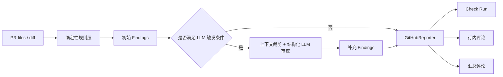

# PR Guardian｜审查链路与干跑样例

## 1. 这页解决什么问题

这页把三个关键问题讲清楚：

- 为什么这个项目不是纯规则扫描器
- 为什么它也不是“把 diff 丢给模型”的黑盒工具
- `--dry-run` 和真实 GitHub 回写分别会产出什么

## 2. 审查流水线



## 3. 为什么不是纯规则，也不是纯模型

| 方案 | 优点 | 限制 |
| --- | --- | --- |
| 纯规则 | 稳定、可复现、易回归 | 难理解上下文关系 |
| 纯模型 | 能理解上下文 | 成本、稳定性、可控性都更差 |
| PR Guardian 的双层方案 | 先用规则覆盖高确定性问题，再按策略决定是否启用 LLM | 复杂度略高，但结果更可控 |

对应代码：

- LLM 是否启用：`src/pr_guardian/main.py` 中的 `should_run_llm`
- 结构化输出：`src/pr_guardian/llm/schema.py`
- 三通道回写：`src/pr_guardian/report/github_reporter.py`

## 4. 干跑命令长什么样

```bash
pr-guardian review --repo owner/repo --pr 123 --dry-run
```

当启用 `--dry-run` 时，工具不会回写 GitHub，而是直接打印结构化 findings 列表。

它的价值在于：

- 本地调规则时不依赖真实仓库状态
- 可以把输入 diff、规则命中和输出 JSON 一起归档
- 适合验证”这不是只会发评论的壳”

## 5. 干跑输出示意

下面是结合现有规则样例整理的示意输出：

```json
[
  {
    "rule_id": "security/secrets-scan",
    "severity": "error",
    "title": "Hardcoded Secret",
    "message": "检测到疑似硬编码密钥 (aws_access_key)。",
    "evidence": [
      {
        "file": "src/auth.py",
        "line": 1,
        "snippet": "aws_key = \"AKIA1234567890ABCDEF\""
      }
    ]
  },
  {
    "rule_id": "ci/min-permissions",
    "severity": "error",
    "title": "Workflow Permissions Too Broad",
    "message": "workflow 使用 `permissions: write-all`，权限过宽。",
    "evidence": [
      {
        "file": ".github/workflows/ci.yml",
        "line": 3,
        "snippet": "permissions: write-all"
      }
    ]
  }
]
```

重点不是具体标题，而是输出对象具有固定结构：

- `rule_id`
- `severity`
- `message`
- `evidence`

这让后续 reporter 能稳定地映射到 GitHub 输出通道。

## 6. 三个输出通道分别做什么

### 6.1 Check Run

- 汇总总 Finding 数
- 统计 `error / warning / info`
- 有 `error` 时直接标记 `failure`
- 最多附带 50 条 annotation

这条链路负责 `gating`。

### 6.2 行内评论

- 按 `file + line` 发布 review comments
- 带指纹去重，避免重复刷屏

这条链路负责“把问题钉到代码行”。

### 6.3 汇总评论

- 按 `Security / Correctness / CI / Monorepo / Docs` 分组
- 适合快速看整体风险面

这条链路负责“让审查结论可读”。

## 7. 为什么能做门禁

`GitHubReporter` 会先按严重级分组。

只要存在 `error` 级 Finding：

- `Check Run conclusion = failure`
- PR 可以被质量门禁拦下

这和“只是生成建议”有本质差异。

## 8. 对应验证入口

- 干跑入口：`src/pr_guardian/main.py`
- Reporter 实现：`src/pr_guardian/report/github_reporter.py`
- Reporter 测试：`tests/test_github_reporter.py`
- 规则样例：`docs/审查样例.md`

